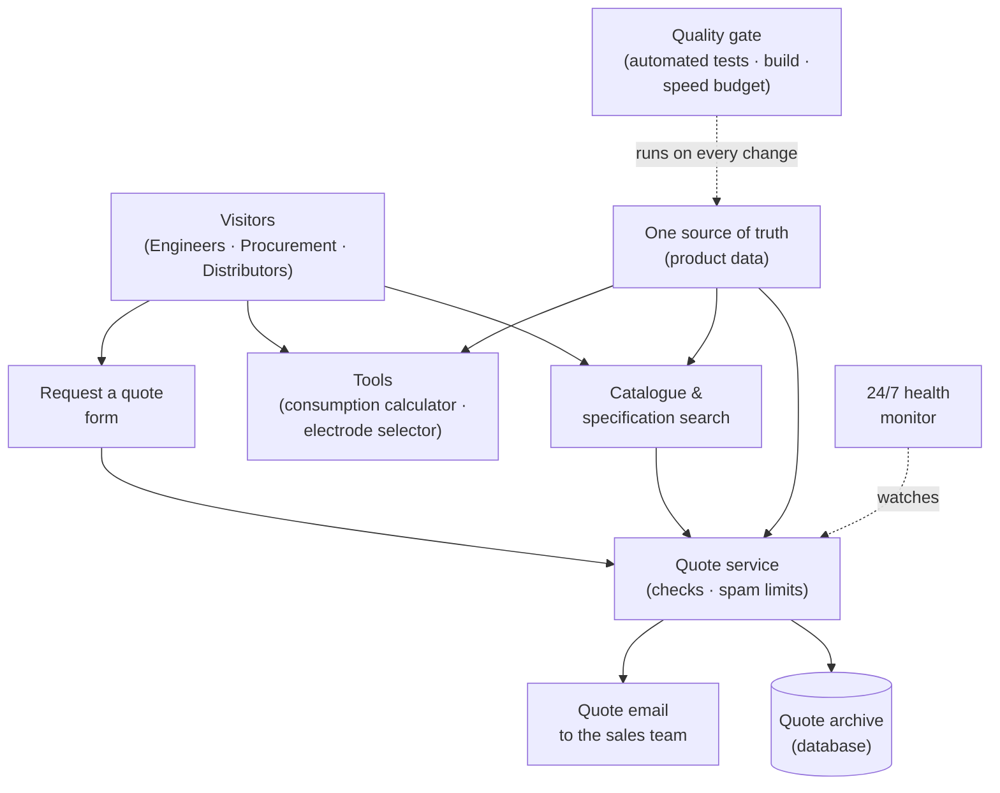

# How the Sunline Endeavour website works

A simple picture of the whole system, for clients and non-technical readers.

## The picture

## What each piece does (plain language)

- **Visitors** — plant and welding engineers, procurement managers, and
  distributors. They browse freely; no login, no sign-up, nothing to install.
- **Website** — fast pages showing the product range, a searchable
  specification lookup, two practical tools (consumption calculator and
  electrode selector), and the request-a-quote form.
- **Quote service** — a small server. It checks every quote request is
  complete and correct, blocks spam and repeat submissions, then sends the
  quote to the sales inbox by email and files a copy in the archive.
- **Sales inbox** — every quote lands as an email, with the visitor's details
  in the reply address (so replies reach the right person).
- **Quote archive** — an optional database that keeps a record of every
  request so nothing gets lost.
- **One source of truth** — all product specifications (classifications,
  chemistry, sizes) live in one set of files. The same numbers appear on every
  page, so a visitor can never see two different versions of a spec.
- **Quality gate** — before any change goes live, automated checks run: code
  tests, a data check, a full build, and a speed budget that rejects pages
  that are too heavy. A mistake cannot reach the public site by accident.
- **24/7 health monitor** — an outside service watches the quote service and
  alerts the team the moment anything stops responding.

## Why it is built this way

- **Fast everywhere.** Pages are pre-built and static, so they load instantly
  anywhere in the world — the site stays within a strict speed budget.
- **One source of truth.** Because specs come from one place, the numbers
  engineers compare (amperage, chemistry, classifications) are always the
  same, everywhere on the site.
- **Nothing guessed.** If a specification value has not been verified against
  the actual quality-control datasheet, it is hidden rather than published.
  The list of these pending values is tracked and signed off before launch.
- **Spam-proof by design.** The quote form is rate-limited per visitor and the
  server never trusts browser-side checks.
- **Simple to run.** The only moving parts are a static website, one small
  server, email, and an optional database — no heavy infrastructure.

## What still needs the client before launch

- Confirm the correct phone number, address, legal entity name, and the
  SLE/SEP product prefix for the About/Contact pages.
- Confirm verified specification values from the quality-control datasheets
  (the site already hides anything not confirmed).
- Provide the SMTP/email settings and choose where the site and server will
  be hosted.
